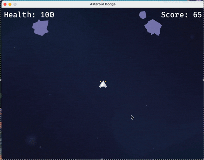

# Asteroid Dodge

A simple asteroid dodging game written in Rust using Bevy.

## Controls

- **Left Arrow:** Fire right thruster
- **Right Arrow:** Fire left thruster
- **Up Arrow:** Fire both thrusters
- **Down Arrow:** Fire reverse thruster
- **Space bar:** Fire projectile

## Objectives:

- Avoid colliding with asteroids
- Destroy asteroids with projectiles
- Don't die

Licence: ? MIT i guess, this is just for fun
